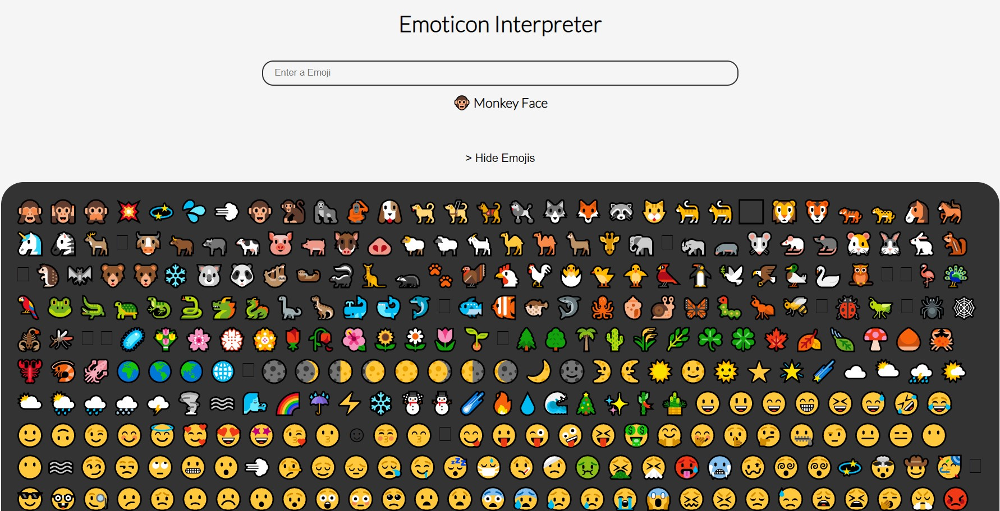

# Emoticon Interpreter

## Description

###### (levelZero_markEight)

The interpreter displays the name of the emoji entered by the user manually or selected from the list of Emojiss
The Emojis are present as an array of objects in the asset folder.



### My learnings

useRef hook is used to directly create a reference to the DOM element in the functional component. The useRef returns a mutable object. The value is persisted and can be accessed from the current property of the returned object. The object can persist a value for a full lifetime of the component.

#### Tech Stack

React, CSS

## Installation

```bash
git clone https://github.com/anshulraheja/levelZero_markEight.git
npm install
```

CodeSandBox [Link](https://codesandbox.io/s/github/anshulraheja/levelZero_markEight)
